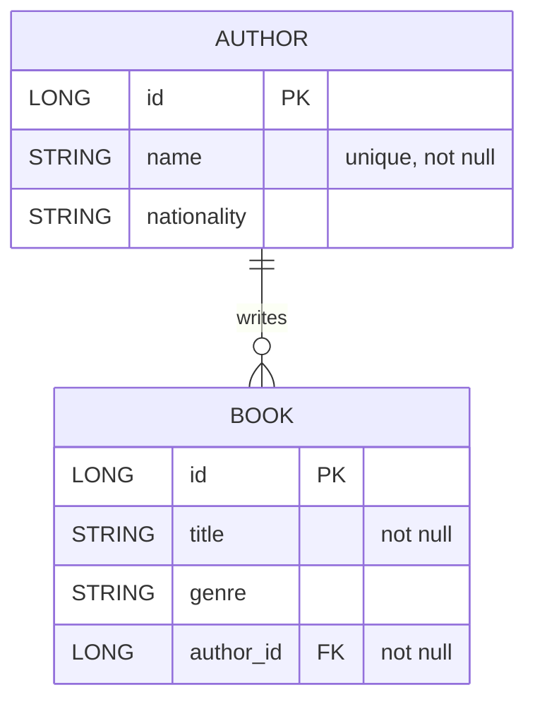
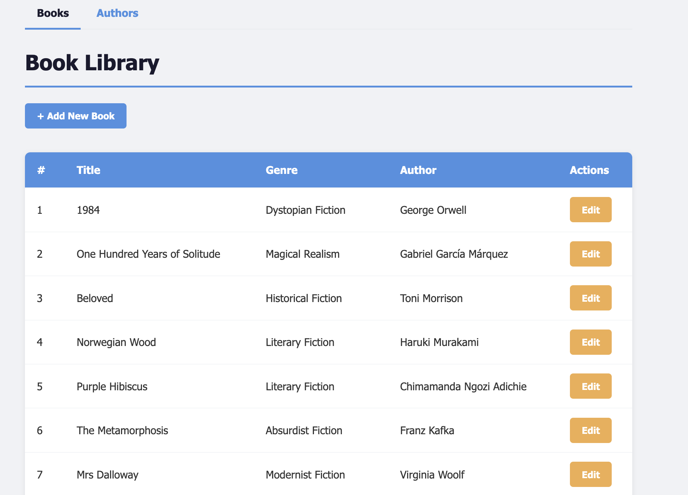
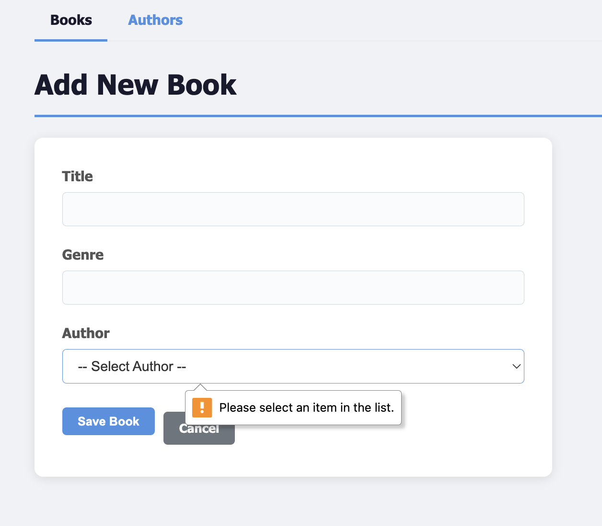
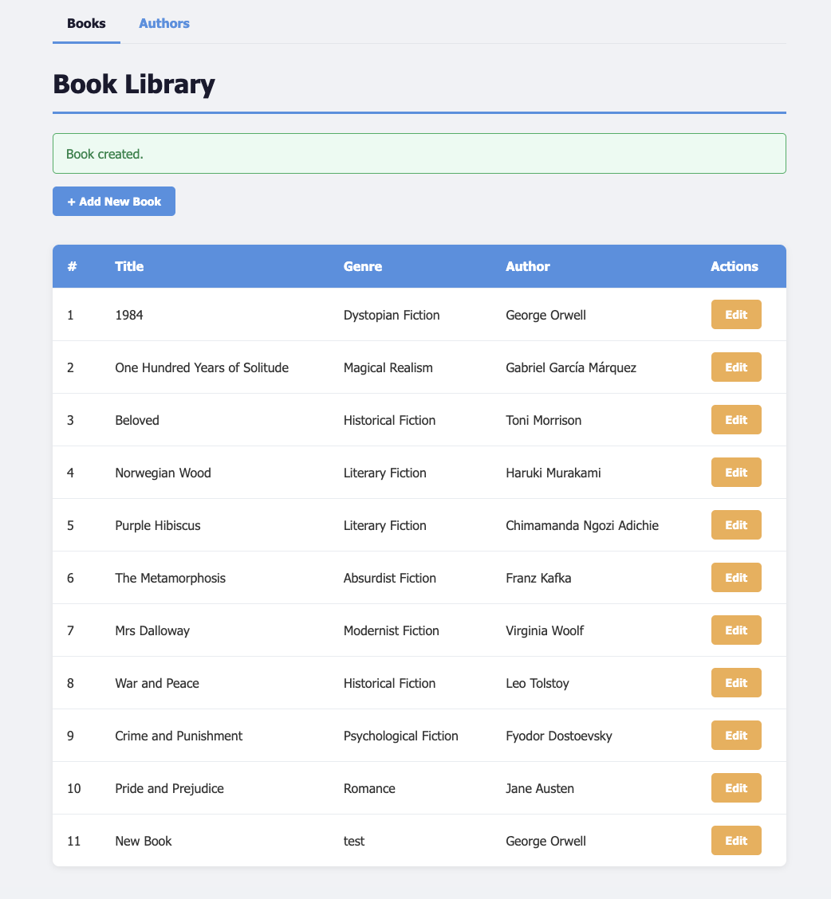
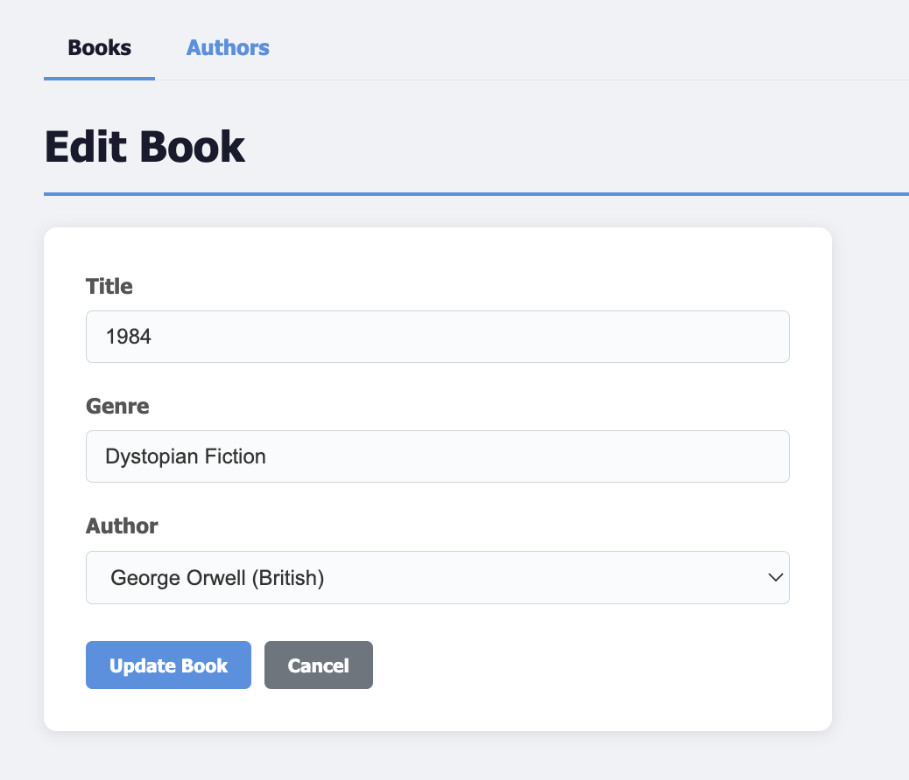
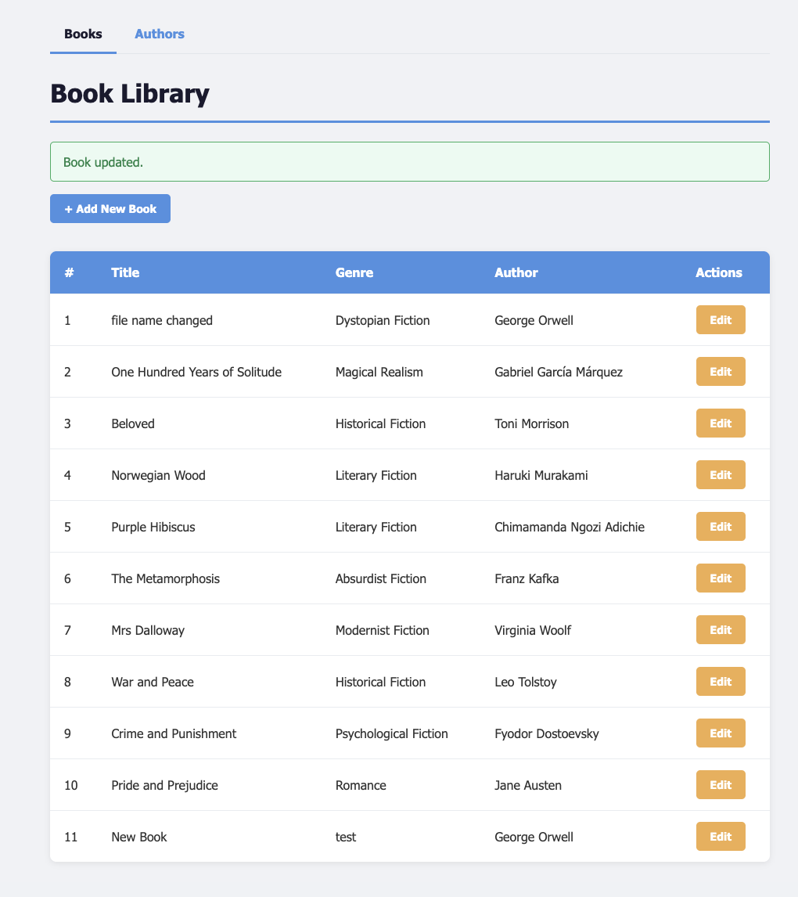
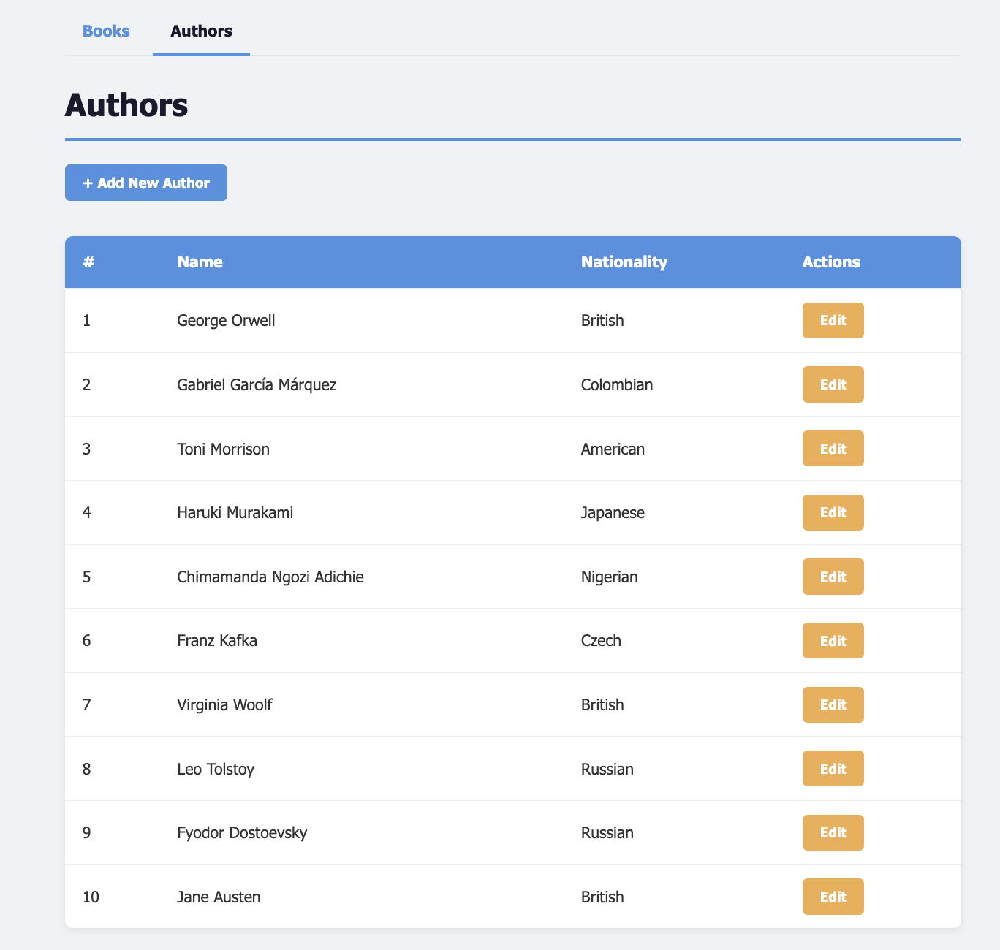
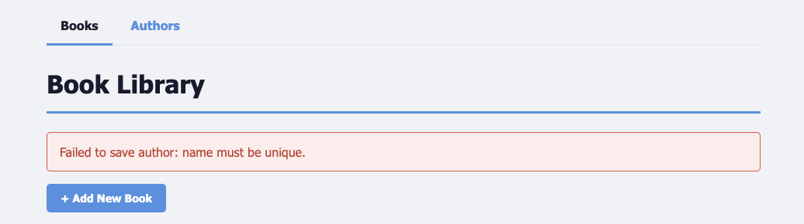
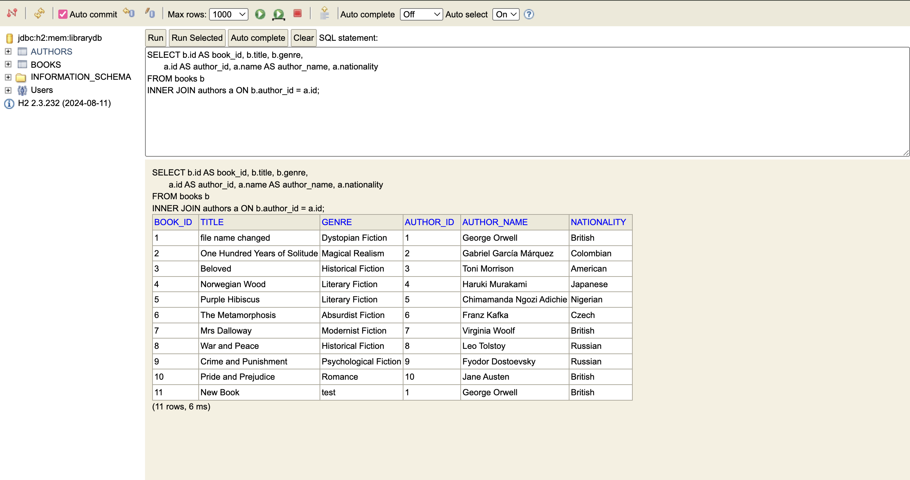

## 2024EB02512

## GitHub Repository

- [github.com/kartavya37/Library-Assignment](https://github.com/kartavya37/Library-Assignment)

# Spring Boot CRU Assignment Report

## Project Overview
This project is a Spring Boot MVC application that manages a small library catalog of **Authors** and **Books**. It implements the three required operations — **Create, Read, and Update** — over both entities, backed by Spring Data JPA on an in-memory H2 database, JSP views with JSTL and Spring's `form` taglib, bean validation, and a layered architecture (controller → service → repository) with a centralized `@ControllerAdvice` exception handler. Service- and repository-layer behavior is verified by JUnit 5 + Mockito unit tests and `@DataJpaTest` slice tests.

## Tech Stack
- Spring Boot 3.5.14 (Web, Data JPA, Validation)
- Java 17
- H2 in-memory database
- JSP + JSTL (Jakarta) + Spring `form:` taglib
- Gradle (wrapper included)
- JUnit 5, Mockito, `@DataJpaTest`

## Entity Relationship Design (Mermaid)


## Entities and Relationships
- **Author** has `id`, `name` (unique, not null), `nationality`, and a `List<Book> books`.
- **Book** has `id`, `title` (not null), `genre`, and a reference to its `Author`.
- **Relationship:** One Author can have many Books (`@OneToMany(mappedBy = "author")`); each Book belongs to exactly one Author (`@ManyToOne` with a NOT-NULL `author_id` FK).
- Bean-validation constraints (`@NotBlank`, `@Size`) are enforced on form input via `@Valid + BindingResult` in the controllers.

## Data Initialization
On startup, `DataInitializer` (a `CommandLineRunner`) inserts **10 Authors and 10 Books** so the application has meaningful data to read on first launch. Each Book is associated with a distinct Author.

## CRU Operations

### Create
- **UI:** Add-Book form (`form.jsp`) and Add-Author form (`author-form.jsp`).
- **Controller:** `POST /books` and `POST /authors`.
- **Validation:** `@Valid @ModelAttribute` + `BindingResult` re-renders the form with inline `field-error` messages on invalid input.
- **Service:** `BookService.save()` / `AuthorService.save()` catch `DataIntegrityViolationException` and rethrow it as a custom `DatabaseException`.

### Read
- **UI:** `list.jsp` (books) and `author-list.jsp` (authors) render tabular views.
- **Controller:** `GET /books` and `GET /authors`.
- **Repository — custom inner-join queries:**
  ```java
  // BookRepository
  @Query("SELECT b FROM Book b INNER JOIN FETCH b.author a")
  List<Book> findAllBooksWithAuthors();

  // AuthorRepository
  @Query("SELECT DISTINCT a FROM Author a INNER JOIN FETCH a.books")
  List<Author> findAllAuthorsWithBooks();
  ```
  `INNER JOIN FETCH` eagerly loads the associated entity in a single SQL statement (no N+1, no `LazyInitializationException` after the session closes).

### Update
- **UI:** Edit form pre-populated via Spring's `form:` taglib, reused by both create and update.
- **Controller:** `GET /books/edit/{id}` and `POST /books/update/{id}` (mirrored for authors).
- **Service:** `BookService.update()` / `AuthorService.update()` load the existing entity, copy the editable fields, and save — preserving the identity and any non-mutable fields.

## Exception Handling
- Service methods translate `DataIntegrityViolationException` into a custom `DatabaseException` with a user-friendly message ("name must be unique", "constraint violation", etc.).
- A global `@ControllerAdvice` (`GlobalExceptionHandler`) catches every `DatabaseException`, attaches the message as a flash attribute, and redirects to `/books` so the user sees a red error banner instead of a stack trace.

## View Layer (JSP)
- `list.jsp` — books table with title, genre, author, and an Edit button.
- `form.jsp` — shared create/update form for books, with an authors dropdown and inline validation errors.
- `author-list.jsp` and `author-form.jsp` — equivalent pair for authors.
- A shared **top nav** links between Books and Authors; success and error banners render flash attributes.
- JSTL (`jakarta.tags.core`) handles iteration/conditionals; Spring's `form:` taglib (`http://www.springframework.org/tags/form`) handles model-bound inputs and field-error rendering.

## Testing
- **`BookServiceTest`** (7 tests) — find / save / update happy paths plus `DatabaseException` on missing IDs and constraint violations.
- **`AuthorServiceTest`** (7 tests) — same shape for the Author service.
- **`BookRepositoryTest`** (3 tests, `@DataJpaTest`) — verifies the `INNER JOIN FETCH` query and that authors are eagerly initialized after the persistence context is cleared.
- **`AuthorRepositoryTest`** (2 tests, `@DataJpaTest`) — verifies the inner join excludes authors who have no books, and that the unique-name constraint fires on duplicate inserts.
- **Total: 19 tests across 4 suites, all passing.**

## How to Run
1. `./gradlew test` — run all unit and slice tests.
2. `./gradlew bootRun` — start the application on port 8080.
3. Open `http://localhost:8080/` (redirects to `/books`).
4. H2 console: `http://localhost:8080/h2-console` — JDBC URL `jdbc:h2:mem:librarydb`, user `sa`, blank password.

## Screenshots

### Books List


### Create Book Form


### Validation Error (blank title)


### After Create


### Edit Book Form


### After Update


### Authors List


### Duplicate Author Error


### H2 Console — Inner Join Query



## Challenges and Solutions
- **JSP under Spring Boot 3 / Jakarta namespace.** Modern Spring Boot uses the `jakarta.*` namespace, so the older `javax.servlet.jsp.jstl` artifacts no longer work. Resolved by adding `tomcat-embed-jasper` and the **Jakarta** JSTL artifacts (`jakarta.servlet.jsp.jstl-api` + `org.glassfish.web:jakarta.servlet.jsp.jstl`).
- **Lazy-loading errors after the session closes.** Plain `INNER JOIN` left the `author` association as a lazy proxy, which threw `LazyInitializationException` during JSP rendering. Switched to `INNER JOIN FETCH` so the association is initialized in the same query.
- **Conditional form action URL.** The first version of `form.jsp` split the `<form>` opening tag across `<c:choose>` branches, which was fragile and broke validation re-renders. Refactored to compute the action URL into a single `<c:set>` variable and use a single `<form:form>` tag for both create and update.
- **Centralized error handling.** Per-method `try/catch` blocks duplicated the same flash-attribute logic in every controller method. Replaced with a single `@ControllerAdvice` (`GlobalExceptionHandler`) that catches `DatabaseException` for the whole application.

